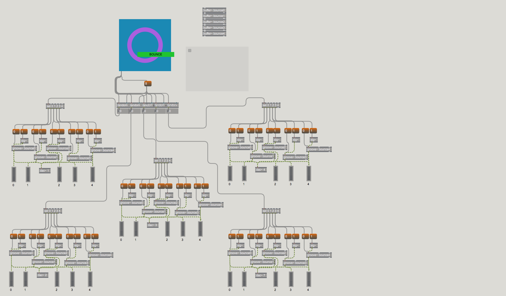

# bounce_project
You walk into a room. The lights are dim, and there are people around. Welcome to Bounce!
In the middle of the room is a podium with an iPad in the middle. 
The iPad is open with a screen containing just one big button in the middle that says "Bounce"
There are 5 studio monitors on all sides of you. What do you do?
You push the button!

Bounce randomly selects from a list of samples and assigns them to each monitor. Every time you press the button,
a new set of samples (often the same ones) are sent out to each monitor. You hear some fun sounds that are addicting.
It's addicting. Press again! Press again! Keep pressing, trying to get your favorite sounds to come back.

Bounce was made using Max 7, and it is only intended to be an audience-participation based art project.

